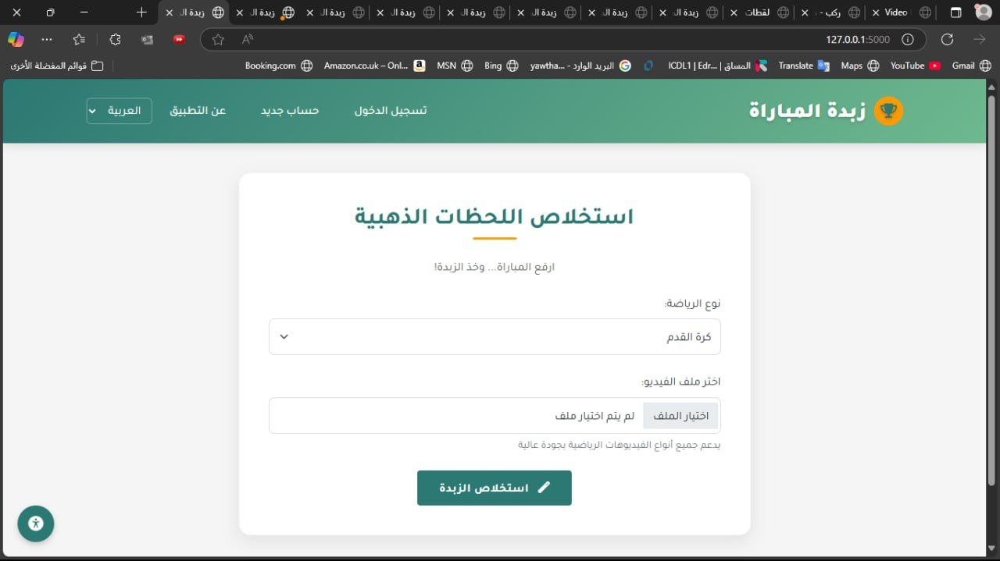
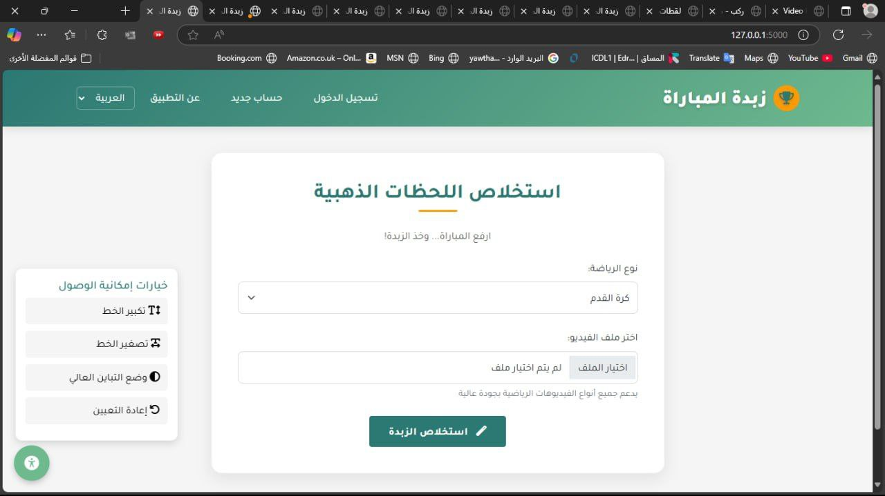
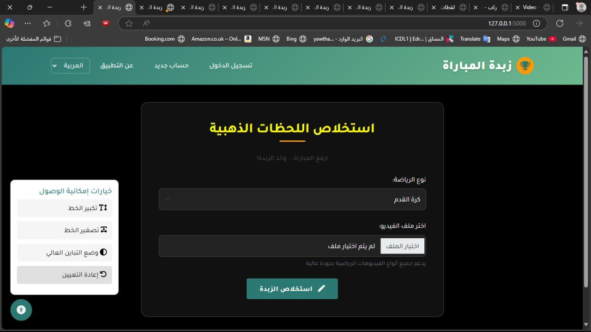
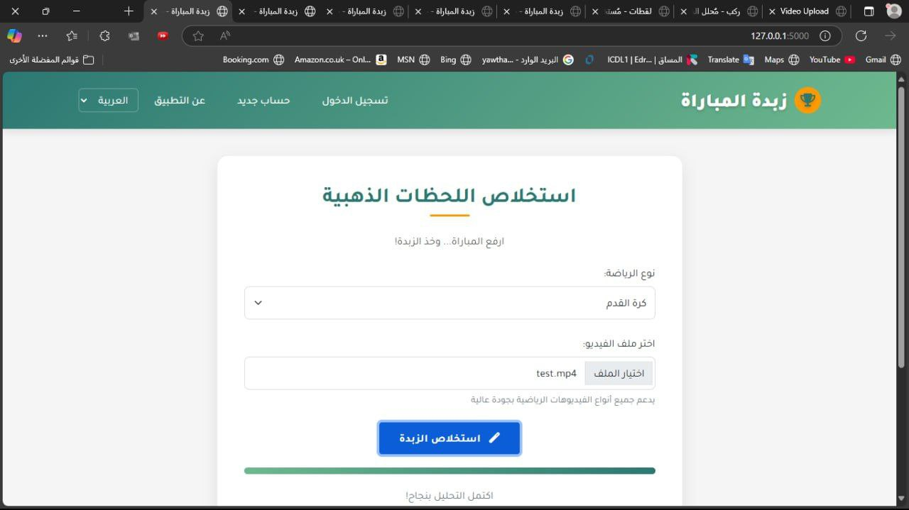
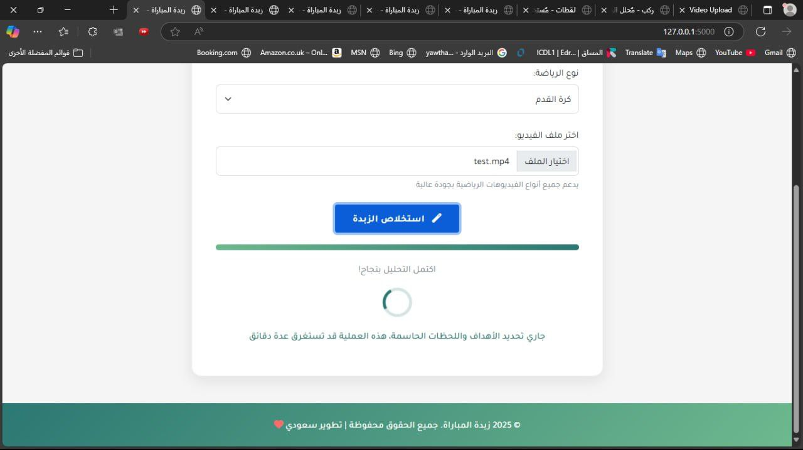

# ⚽ Smart Sports Summary Platform (Zubdat Al-Mubara)

An AI-powered platform that automatically generates concise football match highlight videos by detecting key events such as goals and cards — saving users the time of watching full matches.

---

## 🚀 Project Overview

- **AI backend:** Python scripts leveraging OpenAI's Whisper model for speech-to-text to extract commentary and detect key events.
- **Frontend:** A simple website built with HTML, CSS, and JavaScript to present the generated video summaries.
- The platform produces **highlight videos only** — no text-based summaries are generated.

---

## 🛠️ Technologies & Libraries

- **Python libraries:**  
  - `openai-whisper` — speech-to-text processing  
  - `moviepy` — video editing and concatenation  
  - `numpy`, `pandas` — data handling  
  - `tqdm` — progress bars during processing  
  - `ffmpeg-python` — interfacing with FFmpeg for video operations

- **Frontend:**  
  - HTML / CSS / JavaScript for user interface and video playback

---

## ⚙️ Setup & Installation Instructions

1. **Clone the repository**

```bash
git clone https://github.com/yourusername/yourrepo.git
cd yourrepo
````

2. **Create and activate a Python virtual environment** (recommended)

* On Windows:

```bash
python -m venv venv
venv\Scripts\activate
```

* On macOS/Linux:

```bash
python3 -m venv venv
source venv/bin/activate
```

3. **Install required Python libraries**

```bash
pip install -r requirements.txt
```

*If `requirements.txt` is not available, manually install the dependencies:*

```bash
pip install openai-whisper moviepy numpy pandas tqdm ffmpeg-python
```

4. **Ensure FFmpeg is installed on your system**

* FFmpeg is required for video processing.
* Download from [FFmpeg official site](https://ffmpeg.org/download.html) and add it to your system PATH.

---

## 🖥️ Running the AI Processing Script

Run the main Python script to process a full match video, generate the text transcript with Whisper, detect key events, and produce a highlight video.

```bash
python highlight_generator.py --input path/to/match_video.mp4 --output path/to/output_summary.mp4
```

*Replace the paths with your actual video file locations.*

---

## 📸 Project Demo & Usage Screenshots

Below are screenshots illustrating the key steps of using the Smart Sports Summary Platform:

1. **Website Homepage**
   
   The main interface where users start.

2. **Quick Access Button Clicked**
   
   Accessing the video upload and summary features quickly.

3. **Dark Mode Activated**
   
   Night theme for comfortable viewing.

4. **Video Selected for Processing**
   
   Choosing a match video to analyze.

5. **Video Running and Being Analyzed**
   
   The backend AI processing the video and extracting highlights.

6. **Summary Video Generated**
   
   Final highlight video ready for playback.

---

## 🔧 Notes

* The project uses the pre-trained Whisper model; no additional training is required.
* Only highlight videos are produced — no text summaries.
* The frontend website serves to display the generated highlight videos.
* Make sure to have FFmpeg installed and accessible from your system PATH.

---

## 👩‍💻 Developer

**Yara** — Computer Science student passionate about AI-driven media solutions aligned with Saudi Vision 2030.

---

## 🌟 Vision

This project enhances sports media consumption by leveraging AI to create accessible, efficient video summaries — empowering fans and media professionals alike.

